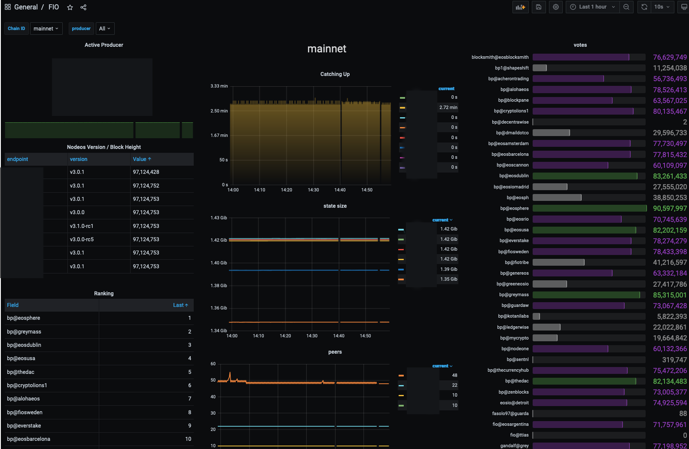

# fio-prometheus-exporter

This is a simple prometheus exporter for FIO nodeos nodes. It can connect to multiple nodes to display a few critical statistics.

## Data Provided

**_Note:_ not all of the APIs are enabled by default because they are dangerous, and could allow bad things to happen. If you enable the net or producer API plugins, be sure to block access to `/v1/net/*` and `/v1/producer/*` from outside connections!**

### Labels

By default the following labels are provided:

- `chain_id` will be 'mainnet', 'testnet', or if not recognized, the hash.
- `version` the friendly version string provided by the node.
- `host` the hostname of the instance (provided because the `{{instance}}` variable will not be the actual host)

Any metrics related to a producer will have an addition label, aptly named `producer`

### Standard endpoints (should work by default)

- `fio_info_head_block` head block number from get_info endpoint
- `fio_info_head_lag` seconds behind the head block
- `fio_info_lib last` irreversible block number from get_info endpoint


- `fio_producer_is_active` whether producer is set to active
- `fio_producer_is_top21` whether producer is in the top 21: 0 if false
- `fio_producer_last_bpclaim_delta` seconds since last bpclaim
- `fio_producer_rank` producer rank
- `fio_producer_schedule_active` active producer schedule
- `fio_producer_schedule_pending` pending producer schedule
- `fio_producer_schedule_proposed` proposed producer schedule
- `fio_producer_votes` producer votes in FIO


- `fio_runtime_max_transaction_time` maximum transaction time (http_plugin)

### Non standard endpoints:

#### Requires `eosio::producer_api_plugin`

- `fio_producer_producing` if producer api is paused: 1 means actively signing blocks, otherwise null

#### Requires `eosio::db_size_api_plugin`

- `fio_db_free_bytes` bytes remaining for memory state
- `fio_db_used_bytes` bytes used by memory state

#### Requires `eosio::net_api_plugin`

- `fio_net_connected_peers` number of connected peers
- `fio_net_disconnected_peers` number of unreachable peers
- `fio_net_syncing_peers` number of peers catching up

## Grafana

A sample dashboard is available in the `grafana` folder in this repository:



Setup the job in the prometheus.yml like this:

```yaml
scrape_configs:
  - job_name: 'fio'
    static_configs:
      - targets: ["your-node-here:13856"]
```

## Running

```
Usage of fio-prometheus-exporter:
  -no-db
        do not attempt to use the db API
  -no-net
        do not attempt to use the net API
  -no-producer
        do not attempt to use the producer API
  -p int
        port to listen on (default 13856)
  -u string
        nodes to monitor, comma seperated list of http urls (default "http://localhost:8888")
```

Multiple hosts can be provided by seperating the urls with a comma, for example:

```
fio-prometheus-exporter -u http://nodeos1:8888,http://nodeos2:8888,http://nodeos3:8888
```

## Docker

A Dockerfile is available, which will build a trimmed from-scratch container, with the openssl libraries and root certificates needed for connecting to a TLS-enabled host.

```shell
# build:
docker build -t fio-prometheus-exporter .
# run
docker run -d --restart unless-stopped -p 13856:13856 --name fio-prometheus-exporter fio-prometheus-exporter -u http://nodeos1:8888,http://nodeos2:8888,http://nodeos3:8888
```
